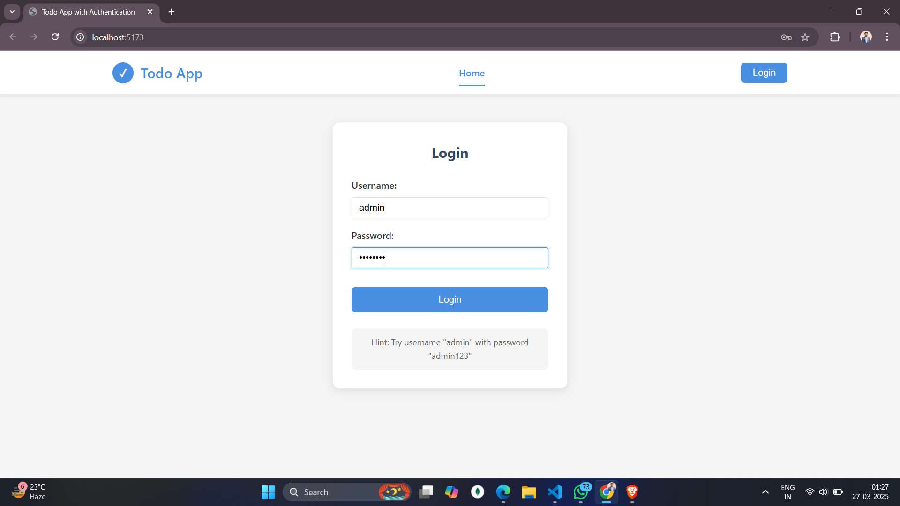
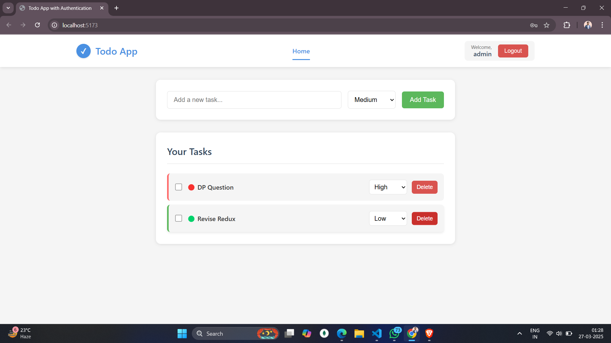
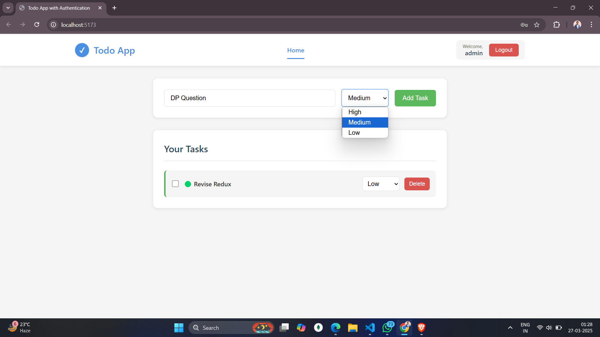
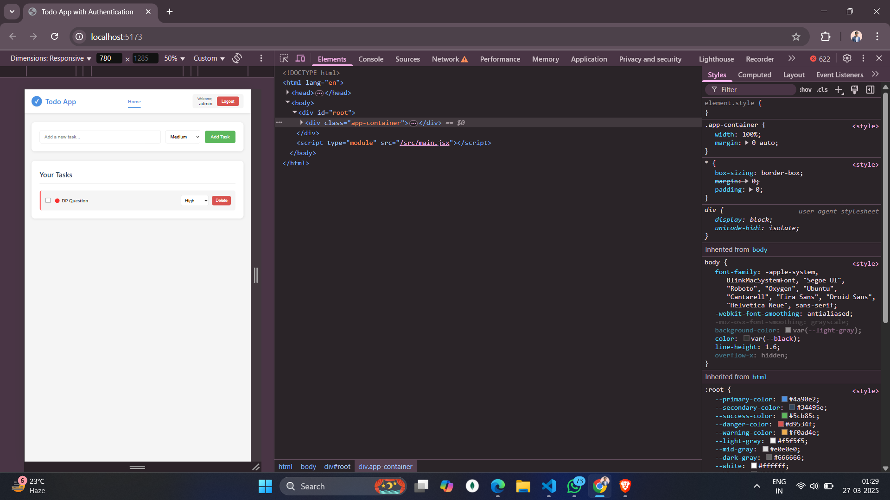

# Todo App with Authentication

A simple React Todo application with user authentication, task prioritization, and localStorage persistence.

## Features

- **User Authentication**: Simple login system with username and password
- **Task Management**:
  - Add tasks with priorities
  - View tasks sorted by priority
  - Delete tasks
  - Mark tasks as completed
- **Priority System**: Tasks can be set as High, Medium, or Low priority
- **Persistence**: Tasks and login state persist through browser sessions using localStorage

## Application Overview

Here's a visual overview of the application:

### Login Screen



### Task Dashboard



### Adding a New Task



### Responsivenes



## Built With

- React 19
- Vite
- Custom Contexts for state management
- localStorage for data persistence

## Getting Started

1. Clone the repository
2. Install dependencies:

```bash
npm install
```

3. Run the development server:

```bash
npm run dev
```

4. Open your browser to `http://localhost:5173`

## Login Credentials

- **Username**: admin
- **Password**: admin123

or

- **Username**: user
- **Password**: user123

## Project Structure

- `/src/components`: UI components
- `/src/contexts`: React contexts for state management
- `/src/utils`: Utility functions for localStorage
- `/src/data`: Static data like user credentials
